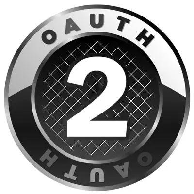

#  🚀💬 RocketChat.Apps-OAuth2 


<!-- PROJECT LOGO -->
<br />
<div align="center">
  <a href="https://github.com/Nabhag8848/RocketChat.Apps-OAuth2">
    
  </a>

  <h3 align="center">RocketChat.Apps-OAuth2</h3>

  <p align="center">
    Using Notion Authorization as Example
<!--     <br />
    <a href="https://github.com/Nabhag8848/RocketChat.Apps-OAuth2"><strong>Explore the docs »</strong></a> -->
    <br />
    <br />
    <a href="https://github.com/Nabhag8848/RocketChat.Apps-OAuth2">View Demo</a>
    ·
    <a href="https://github.com/Nabhag8848/RocketChat.Apps-OAuth2/issues">Report Bug</a>
    ·
    <a href="https://github.com/Nabhag8848/RocketChat.Apps-OAuth2/issues">Request Feature</a>
  </p>
</div>

<div align="center">

[![Contributors][contributors-shield]][contributors-url]
[![Forks][forks-shield]][forks-url]
[![Stargazers][stars-shield]][stars-url]
[![Issues][issues-shield]][issues-url]
[![MIT License][license-shield]][license-url]

</div>

```

    Backward Compatible Approach to Authorize (OAuth2) in RocketChat.Apps incase of different workflow depending upon the platform using 
    Notion Authorization as example to document this. There are limitations of current version of apps-engine and will improve it in future.
    Check About-Project Section to know the Limiation.

```


##  📜 Getting Started

### Prerequisites

- You need a Rocket.Chat Server Setup
- Rocket.Chat.Apps CLI, 
* In case you don't have run:
  ```sh
  npm install -g @rocket.chat/apps-cli
  ```
- Make sure to Enable development mode


### ⚙️ Installation
- Every RocketChat Apps runs on RocketChat Server, thus everytime you wanna test you need to deploy the app with this note. lets start setting up:

1. Clone the repo
   ```sh
   git clone https://github.com/<yourusername>/RocketChat.Apps-OAuth2
   ```
2. Install NPM packages
   ```sh
   cd oauth2; npm install
   ```
3. Deploy app using:
   ```sh
   rc-apps deploy --url http://localhost:3000 --username <username> --password <password>
   ```
<!-- PROJECT SHIELDS -->
<!--
*** I'm using markdown "reference style" links for readability.
*** Reference links are enclosed in brackets [ ] instead of parentheses ( ).
*** See the bottom of this document for the declaration of the reference variables
*** for contributors-url, forks-url, etc. This is an optional, concise syntax you may use.
*** https://www.markdownguide.org/basic-syntax/#reference-style-links
-->
>

4. Once its deploy, Go to Installed Apps and Settings tab in RC,you would see three input fields:
   ```
   
    # notion-client-id
    # notion-client-secret
    // Generate above Credentials from Notion By Creating the *Public* Integration. Attached link above for the same.

    # redirecturi: if you are running server on local then input: http://localhost:3000 else provide your server url without path.
    
   ```
5. Once Its done save the changes, and now under the Notion Integration Provide the Webhook GET endpoint in Redirect URI field of Notion, GET Webhook Endpoint: you can find on the Current App Info under Detail tab in RC.
  

<!-- ABOUT THE PROJECT -->
## ✅ About The Project:
- Issues mentions below aren't possible with current apps-engine framework version (1.37.0 when writing this).
### Why we need backward compatible approach?

Here's why:
* Incase of any platform Authorization workflow can alter than the usual. In Case of Notion, it suggests to use Basic HTTP Authentication when requesting for access_token while providing the code [check here](https://developers.notion.com/docs/authorization#step-3-the-integration-sends-the-code-in-a-post-request-to-the-notion-api)
* Now incase of usual workflow we provide the clientId and clientSecret in params but Notion and in future we may encounter any other platform  which would suggest different ways to provide credentials in Authorization header. In case of Notion they suggested to provide the credentials in form of `Basic CLIENTID:CLIENTSECRET` where the credentials provide should be a base64. 
* In case of any platform we may need the extra info in persistance storage. In case of Notion we needed a lot of extra fields which includes workspace info, access_level of pages, userInfo including the access_token_info etc. [check here](https://developers.notion.com/docs/authorization#step-4-notion-responds-with-an-access_token-and-some-additional-information)

## :rocket: Usage :

```

    Use /notion to Authorize through 🚀💬 following arguments available: 
     • To login your Notion account /notion login.
     • To logout your Notion account /notion logout.
     • To check your status of Authorization with Notion /notion test.
     • To get help of Usage use /notion help.

```
<!-- CONTRIBUTING -->
## 🧑‍💻 Contributing

Contributions are what make the open source community such an amazing place to learn, inspire, and create. Any contributions you make are **greatly appreciated**.

If you have a suggestion that would make this better, please fork the repo and create a pull request. You can also simply open an issue with the tag "enhancement".
Don't forget to give the project a star! Thanks again!

1. Fork the Project
2. Create your Feature Branch (`git checkout -b feature/AmazingFeature`)
3. Commit your Changes (`git commit -m 'Add some AmazingFeature'`)
4. Push to the Branch (`git push origin feature/AmazingFeature`)
5. Open a Pull Request

## 📚 Resources
Here are some links to examples and documentation:
- [Rocket.Chat Apps TypeScript Definitions Documentation](https://rocketchat.github.io/Rocket.Chat.Apps-engine/)
- [Rocket.Chat Apps TypeScript Definitions Repository](https://github.com/RocketChat/Rocket.Chat.Apps-engine)
- [Example Rocket.Chat Apps](https://github.com/graywolf336/RocketChatApps)
- [DemoApp](https://github.com/RocketChat/Rocket.Chat.Demo.App)
- Community Forums
  - [App Requests](https://forums.rocket.chat/c/rocket-chat-apps/requests)
  - [App Guides](https://forums.rocket.chat/c/rocket-chat-apps/guides)
  - [Top View of Both Categories](https://forums.rocket.chat/c/rocket-chat-apps)
- [#rocketchat-apps on Open.Rocket.Chat](https://open.rocket.chat/channel/rocketchat-apps)


<!-- MARKDOWN LINKS & IMAGES -->
<!-- https://www.markdownguide.org/basic-syntax/#reference-style-links -->
[contributors-shield]: https://img.shields.io/github/contributors/othneildrew/Best-README-Template.svg?style=for-the-badge
[contributors-url]: https://github.com/Nabhag8848/RocketChat.Apps-OAuth2/graphs/contributors
[forks-shield]: https://img.shields.io/github/forks/othneildrew/Best-README-Template.svg?style=for-the-badge
[forks-url]: https://github.com/Nabhag8848/RocketChat.Apps-OAuth2/network/members
[stars-shield]: https://img.shields.io/github/stars/othneildrew/Best-README-Template.svg?style=for-the-badge
[stars-url]: https://github.com/Nabhag8848/RocketChat.Apps-OAuth2/stargazers
[issues-shield]: https://img.shields.io/github/issues/othneildrew/Best-README-Template.svg?style=for-the-badge
[issues-url]: https://github.com/Nabhag8848/RocketChat.Apps-OAuth2/issues
[license-shield]: https://img.shields.io/github/license/othneildrew/Best-README-Template.svg?style=for-the-badge
[license-url]: https://github.com/Nabhag8848/RocketChat.Apps-OAuth2/blob/master/LICENSE.txt
